## Science needs to be more open

<center>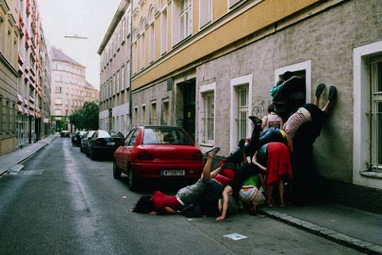</center>

[http://everyoneknowsbest.files.wordpress.com/2008/08/bodysculpture.jpg](http://everyoneknowsbest.files.wordpress.com/2008/08/bodysculpture.jpg)

---

<!-- But we need tools to do it! -->

<center>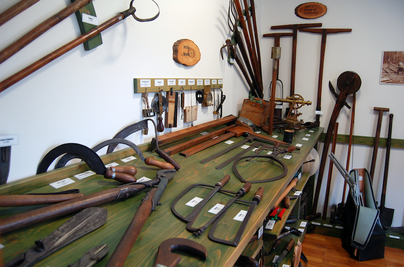</center>

[http://www.fotopedia.com/items/flickr-4796633039](http://www.fotopedia.com/items/flickr-4796633039)

---

## What kinds of tools? Not these

<center>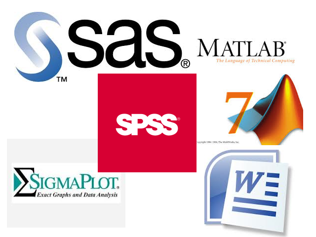</center>

---

## These!

<center>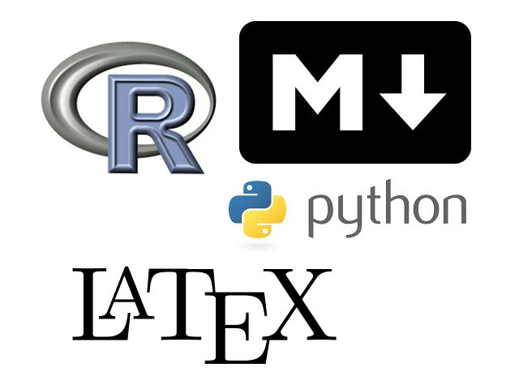</center>

---

## What does an ecologist do?

+ Collect data
+ Manipulate data
+ Visualize
+ Analyze
+ Write

---

## Data increasingly on the web

<center>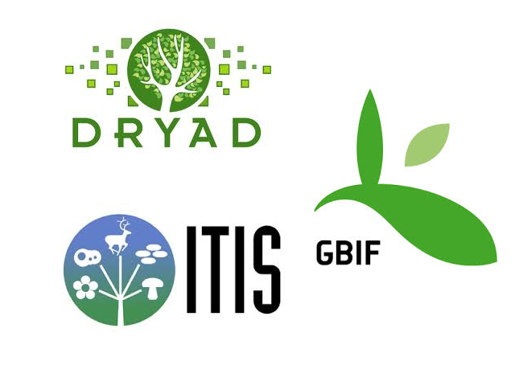</center>

---

## R may be the perfect solution (for ecologists)

<center>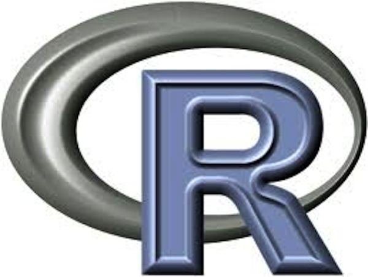</center>

---

## Why?

+ R is Open source = Free + Rapid change
+ R = entire workflow in 1 place
+ R = reproducible science

---

## The toolbet

<center>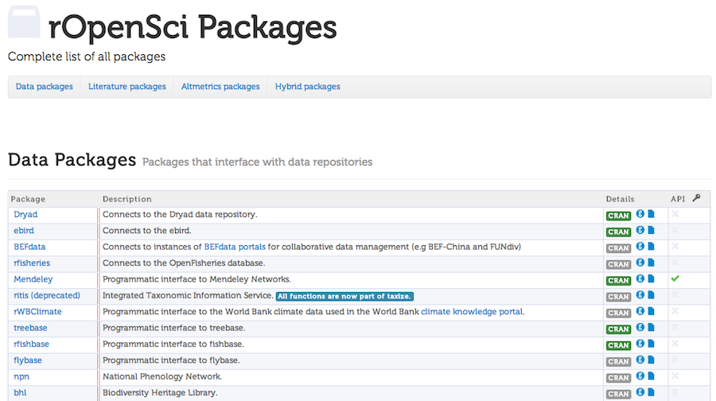</center>

[http://ropensci.org/](http://ropensci.org/)

---

## Data

<center>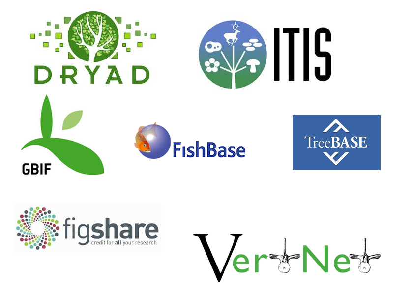</center>

---

## Literature

<center>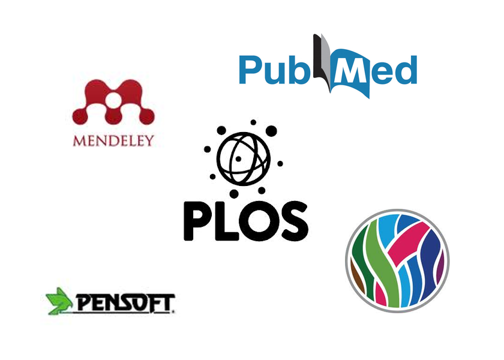</center>

---

#### Make an API call
```r
library(RCurl); library(RJSONIO)
dat <- fromJSON(getURL("https://api.github.com/users/hadley/repos"))
```

#### Manipulate the data</h3> 
```r
library(plyr); library(reshape2)
dat_melt <- melt(ldply(dat, function(x) data.frame(x[names(x) %in% c("name","watchers_count","forks")])))
```

#### Run some statistical model
```r
lm(value ~ variable, data = dat_melt)
```

#### Visualize results
```r
library(ggplot2)
ggplot(dat_melt, aes(name, value, colour = variable)) + geom_point() + coord_flip()
```

#### Write the paper
```r
# Introduction...
```

---

## Taxonomy


```r
library(taxize)
specieslist <- "Abies procera"
classification(specieslist, db = "itis")
```

```
$`Abies procera`
        rankName       taxonName    tsn
1        Kingdom         Plantae 202422
2     Subkingdom  Viridaeplantae 846492
3   Infrakingdom    Streptophyta 846494
4       Division    Tracheophyta 846496
5    Subdivision Spermatophytina 846504
6  Infradivision    Gymnospermae 846506
7          Class       Pinopsida 500009
8          Order         Pinales 500028
9         Family        Pinaceae  18030
10         Genus           Abies  18031
11       Species   Abies procera 181835
```


---


```r
library(rgbif)
splist <- c("Accipiter erythronemius", "Junco hyemalis", "Aix sponsa", "Podiceps cristatus")
out <- occurrencelist_many(splist, coordinatestatus = TRUE, maxresults = 40)
gbifmap_list(out)
```

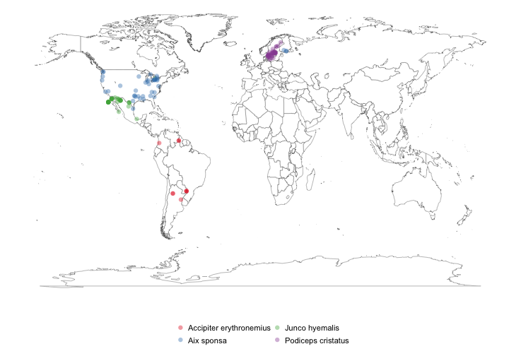 


---


```r
library(rbison)
out <- bison(species = "Helianthus annuus", type = "scientific_name", count = 500)
bisonmap(input = out, tomap = "county")
```

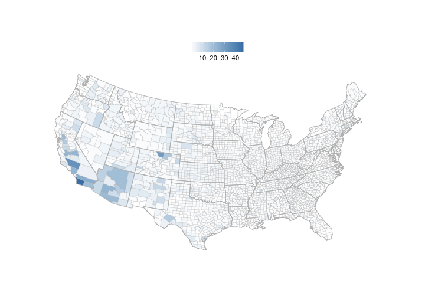 


---


```r
print("foo bar")
```

```
## [1] "foo bar"
```


---

## Take action!


<i class="icon-unlock icon-4x"></i> &nbsp;&nbsp;&nbsp;&nbsp; <i class="icon-wrench icon-4x"></i> &nbsp;&nbsp;&nbsp;&nbsp; <i class="icon-question icon-4x"></i>

---

## The deets

+ Presentation made using [slidify][slidify]
+ Written in markdown
+ See it online here: <give link>

[slidify]: https://github.com/ramnathv/slidify


<!-- 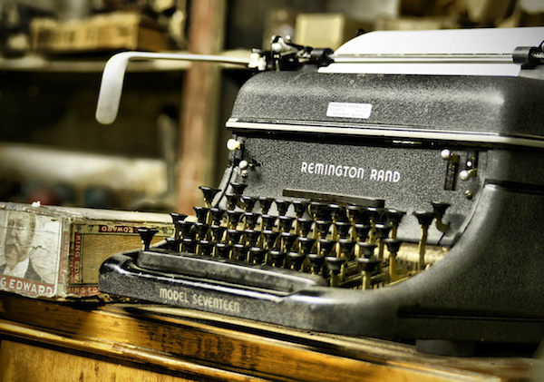
[http://www.fotopedia.com/items/flickr-2621358221](http://www.fotopedia.com/items/flickr-2621358221) -->
